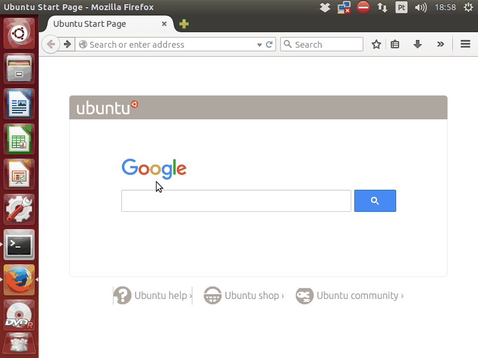
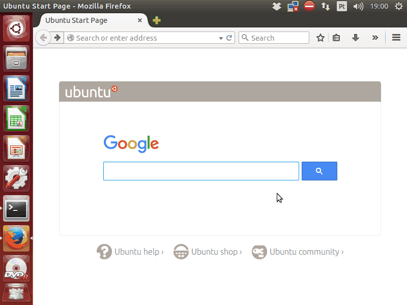

# XMousable

Allows you to use the keyboard to move and click on a X11 screen (most Linux screens).

OR

A convenient way to use the keyboard for operations that you still didn't figure out how to bind to a key.

## Installation

Download the latest version in the dist folder:

https://github.com/marcofognog/xmousable/tree/master/dist

... and bind the binary to you favorite key.

## Usage example

Just calling it from the command line will put the computer in this "mode" where the mouse pointer will respond to the keyboard.

For example:

```sh
$ ~/xmousable-v.0.1.0
```

Here is what it looks like (without configuration)



Each highlighted area corresponds to a key, so you can jump right to where you want to click, and do the fine adjustment with the arrow keys.

Here is a better looking one ( called with `-l` flag)



I promise you it looks so much better with a cleaner WM such as Awesome or I3.

## Development setup

Would be great to make the build more portable, for now running only `make` is enough to produce binary.

```sh
$ make
```

## Contributing

All contributions are always welcomed.
If you have any trouble, please get in touch, I'd be glad to help.

## Meta

Distributed under the MIT-LICENSE . See ``MIT-LICENSE`` for more information.

https://github.com/marcofognog/xmousable
